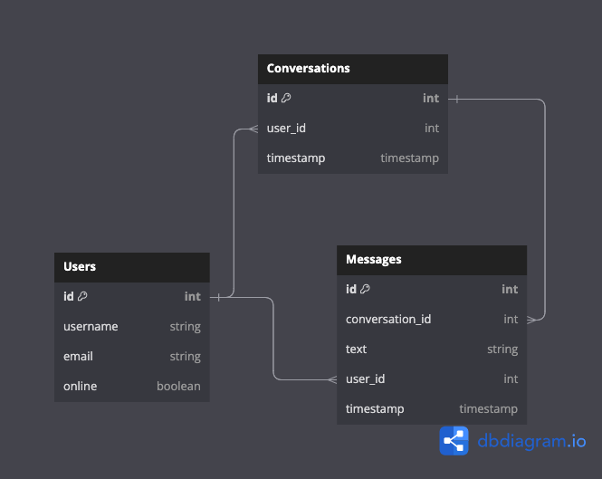

# Messenger

Messenger is a simple, user-friendly real-time chat web application that enables one-to-one communication between users. Users can create accounts to send text messages and images to each other seamlessly.

## Features

- Real-time one-to-one chatting.
- Account creation and authentication.
- Image and Text messaging.
- Intuitive UI/UX.

## Data model

The application relies on three main tables: User, Conversations, and Messages.



## Technologies

- Frontend: React
- Backend: Express
- Database: PostgreSQL

## Prerequisites

Before you begin, ensure you have met the following requirements:

- You have a working installation of Node.js and npm.
- You have PostgreSQL installed.

## Initial Setup

### Databse Setup

Create the PostgreSQL database. These instructions may need to be adapted depending on your operating system.

```
psql
CREATE DATABASE messenger;
\q
```

### Server Setup

1. Navigate to the server directory, install the necessary dependencies, and seed the database.

```
cd server
npm install

```

2. Create a .env file in the server directory and add your session secret.

```
SESSION_SECRET = "your session secret"
```

### Client Setup

1. In the client folder, install the necessary dependencies.

```
cd client
npm install
```

## Running the Application Locally

### Start the Frontend

```
cd client
npm start
```

The frontend will be live at http://localhost:3000.

### Start the Frontend

In a separate terminal window, navigate to the server directory and run:

```
cd server
npm run dev
```

## Usage

After setting up the application, users can create an account or log in to start chatting in real time.

## License

[MIT](https://choosealicense.com/licenses/mit/)
